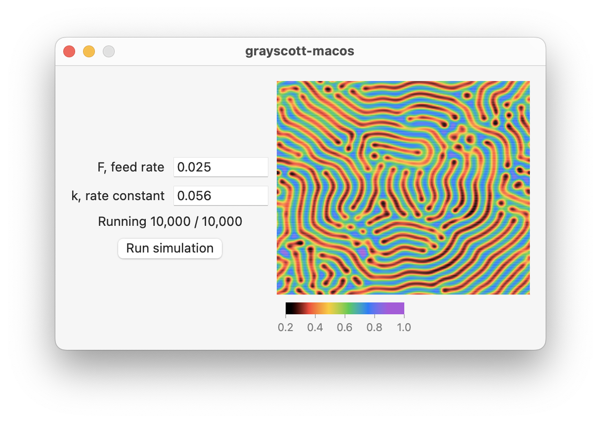
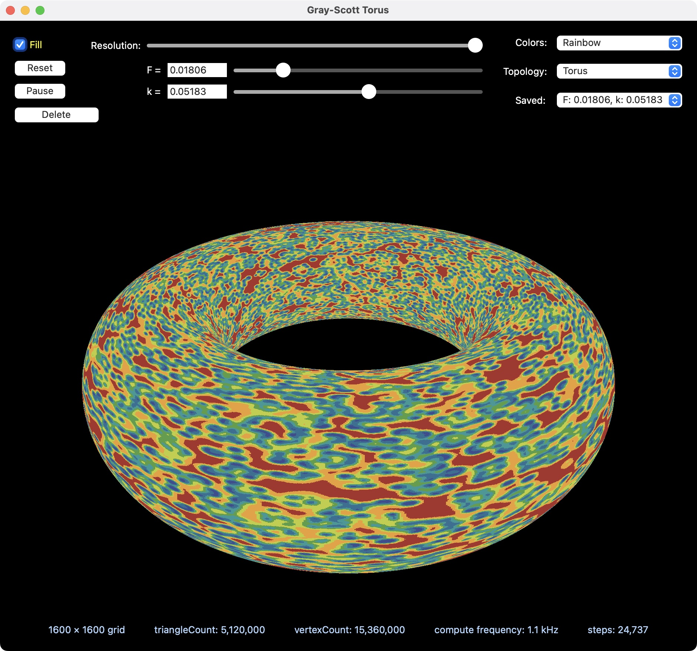
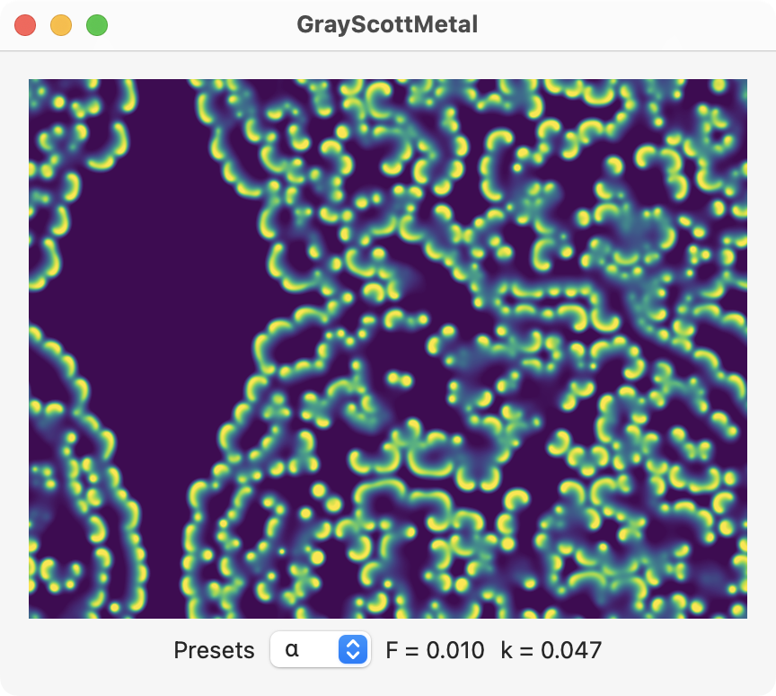

# Gray-Scott model

This repository contains examples of implementing the Gray-Scott model in various programming languages.

## Governing equations

The Gray-Scott model represents the following irreversible reactions where $P$ is an inert product:

```math
\begin{align}
    U + 2V &\rightarrow 3V \\
    V &\rightarrow P
\end{align}
```

The resulting reaction-diffusion equations in dimensionless units are shown below where $k$ is the dimensionless rate constant of the second reaction and $F$ is the dimensionless feed rate. The diffusion coefficients are $D_u$ and $D_v$ and $\nabla^2$ represents the Laplacian operator.

```math
\begin{align}
    \frac{\partial U}{\partial t} &= D_u \nabla^2 U - U V^2 + F (1 - U) \\
    \frac{\partial V}{\partial t} &= D_v \nabla^2 V + U V^2 - (F + k) V
\end{align}
```

## Examples

Examples of solving the Gray-Scott model in Python, Swift, and Julia are available in this repository. See the comments in the code for more information about that particular example. The examples use model parameters and boundary conditions defined in the Pearson 1993 article. The Laplacian is calculated using a five-point stencil with periodic boundary conditions.

### Julia

The `center.jl` is an example of assigning values at the center of a matrix. The `stencil.jl` demonstrates a two-dimensional five-point stencil. The Gray-Scott model is solved in `grayscott_loops.jl`, `grayscott_slices.jl`, and `grayscott_views.jl` using loops, array slices, and views.

### Python

The `laplacian.py` contains examples of calculating the Laplacian using a five-point stencil and periodic boundary conditions. The Gray-Scott model is solved in `grayscott_slices.py` and `grayscott_movie.py` saves an animation of the results.

 

The table below compares the elapsed times for each Laplacian function in `laplacian.py` for a 512x512 array. The results are from a 2019 MacBook Pro running a 2.6 GHz 6-core Intel i7 CPU with 32 GB of RAM.

| Function              | Run 1    | Run 2    | Run 3    |
| --------------------- | -------- | -------- | -------- |
| lap5_loops            | 0.5555 s | 0.5794 s | 0.5660 s |
| lap5_loops2           | 0.5516 s | 0.5396 s | 0.5209 s |
| lap5_slices           | 0.0045 s | 0.0039 s | 0.0034 s |
| lap5_roll             | 0.0064 s | 0.0056 s | 0.0051 s |
| lap5_shift            | 0.0026 s | 0.0025 s | 0.0025 s |
| lap5_convolve         | 0.3192 s | 0.3120 s | 0.3136 s |
| scipy.ndimage.laplace | 0.0737 s | 0.0693 s | 0.0659 s |

### Swift

The Swift examples are available as Xcode projects and a playground in the `swift-examples` folder. The `matrix` project demonstrates a two-dimensional `Matrix` struct that makes matrix calculations easier to work with in Swift. The `laplacian` project calculates the Laplacian of a matrix using a five-point stencil and periodic boundary conditions. The `grayscott` project runs the Gray-Scott model and saves the results to a text file. This text file can be used with NumPy and Matplotlib to plot the results. The `grayscott-jeff` playground uses a `Lattice2d` struct for solving the Gray-Scott model and uses PythonKit to plot the results.

The `GrayScottCharts` project is a macOS app that uses Swift Charts to plot the results as shown in the figure below.

<div align="center">
    
</div>

The `GrayScottColormap` project is a macOS app that uses Core Graphics to plot the results as seen below. This uses the viridis colormap.

<div align="center">
    
</div>

The `Gray-Scott Torus` project is a MacOS app using Metal to explore various values of F and k with periodic boundary conditions, displaying the results in live time on either a plane or a torus projection.

<div align="center">
    
</div>

The `GrayScottMetal` project is a macOS app the uses compute (kernel) shaders in Metal to perform the Gray-Scott calculations and animate the results.

<div align="center">
    
</div>

## Contributing

If you would like to contribute an example to this respository, please create a folder for the example and submit a pull request. Literature such as articles, books, websites, etc. that were used to develop the example should be added to the References section (see below).

## References

References about the Gray-Scott model and numerical techniques for solving it are provided below:

1. John E. Pearson, "Complex Patterns in a Simple System," Science, vol. 261, no. 5118, pp. 189–192, 1993, doi: [10.1126/science.261.5118.189](https://doi.org/10.1126/science.261.5118.189).
2. Abelson, Adams, Coore, Hanson, Nagpal, Sussman, "Gray Scott Model of Reaction Diffusion," Accessed: Aug. 24, 2023. [Online]. Available: https://groups.csail.mit.edu/mac/projects/amorphous/GrayScott/
3. Katharina Kafer and Mirjam Schulz, "Gray-Scott Model of a Reaction-Diffusion System," Accessed: Aug. 24, 2023. [Online]. Available: https://itp.uni-frankfurt.de/~gros/StudentProjects/Projects_2020/projekt_schulz_kaefer/
4. "Five-point stencil," Wikipedia. Jan. 31, 2023. Accessed: Aug. 24, 2023. [Online]. Available: https://en.wikipedia.org/wiki/Five-point_stencil.
5. D. C. Root, "How to obtain the 9-point Laplacian formula?," Mathematics Stack Exchange, Sep. 15, 2018. Accessed: Aug. 24, 2023. [Online]. Available: https://math.stackexchange.com/q/2916234
6. "Discrete Laplace operator," Wikipedia. Jul. 23, 2023. Accessed: Aug. 24, 2023. [Online]. Available: https://en.wikipedia.org/wiki/Discrete_Laplace_operator
7. R. P. Munafo, "Pearson’s Classification (Extended) of Gray-Scott System Parameter Values at MROB," Mar. 18, 2022. Accessed: Aug. 24, 2023. [Online]. Available: http://www.mrob.com/pub/comp/xmorphia/pearson-classes.html
8. K. Sims, "Reaction-Diffusion Tutorial," 2016. Accessed: Aug. 24, 2023. [Online]. Available: http://www.karlsims.com/rd.html
9. K. Sims, "Reaction-Diffusion Explorer Tool," 2016. Accessed: Aug. 24, 2023. [Online]. Available: http://karlsims.com/rdtool.html
